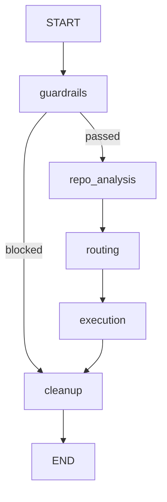

# Orchestrator Agent

LangGraph-based coordinator for DevOps multi-agent workflows.

This service receives a user prompt, applies guardrails, analyzes repository context (local or GitHub), routes intent to specialized agents, executes them, and returns structured results.

## What It Does

- Validates requests with security guardrails.
- Analyzes repository context from:
  - local filesystem path (`--repo-path`)
  - GitHub repository URL (`--github-url`) via GitHub MCP server (with optional PyGithub fallback)
- Routes intent to target agents.
- Executes integrated agents and aggregates outputs.
- Returns orchestration status and agent outputs in a stable JSON structure.

## Current Agent Integration

- Integrated and executable:
  - `cicd-agent`
  - `docker-agent`
  - `iac-agent`
- Routed but currently not executed in this module:
  - `k8s-agent`
  - `monitoring-agent`

If a non-integrated agent is selected, it is marked as `skipped` in output.

## Architecture

The orchestrator is implemented as a LangGraph state machine:

1. `guardrails`
2. `repo_analysis`
3. `routing`
4. `execution`
5. `cleanup`

Guardrails can short-circuit the flow directly to cleanup when a request is blocked.



## Project Layout

- `run_orchestrator.py`: CLI entrypoint (recommended for manual runs).
- `diagnose_orchestrator.py`: component timing diagnostics.
- `test_gha_generation.sh`: end-to-end GitHub Actions generation smoke test.
- `src/orchestrator.py`: backward-compatible orchestrator class.
- `src/orchestrator_graph.py`: LangGraph build/compile/run logic.
- `src/graph_nodes.py`: node implementations and agent subprocess dispatch.
- `src/repo_analyzer.py`: local and GitHub repo analysis.
- `src/guardrails.py`: request safety validation.
- `src/intent_router.py`: fast-path + LLM-based routing.
- `.env.example`: environment template.

## Requirements

- Python 3.10+
- Access to a Groq API key
- For GitHub URL analysis: GitHub personal access token
- For MCP linking: GitHub MCP server command available locally

Install dependencies:

```bash
pip install -r requirements.txt
```

## Configuration

Copy `.env.example` to `.env` and set values:

```env
# Required for orchestrator startup
GROQ_API_KEY=your_groq_api_key_here

# GitHub + MCP integration
GITHUB_PERSONAL_ACCESS_TOKEN=ghp_your_personal_access_token_here
GITHUB_TOKEN=ghp_your_personal_access_token_here
GITHUB_HOST=https://github.com
MCP_GITHUB_ENABLED=true
MCP_GITHUB_SERVER_COMMAND=docker
MCP_GITHUB_SERVER_ARGS=run -i --rm -e GITHUB_PERSONAL_ACCESS_TOKEN -e GITHUB_HOST ghcr.io/github/github-mcp-server
MCP_GITHUB_CALL_TIMEOUT=30
MCP_GITHUB_STRICT=false

# Optional webhook settings
WEBHOOK_SECRET=your_webhook_secret_here
WEBHOOK_PORT=5000
WEBHOOK_HOST=0.0.0.0

# Optional default repository path
TARGET_REPOSITORY_PATH=
```

### Required vs Optional

- Required:
  - `GROQ_API_KEY`
- Optional:
  - `GITHUB_PERSONAL_ACCESS_TOKEN` (or `GITHUB_TOKEN`) required when using `--github-url`
  - `GITHUB_HOST` (for GHES/ghe.com hosts)
  - MCP server command/args override vars if your environment uses a different launch method
  - `MCP_GITHUB_STRICT=true` to disable PyGithub fallback and fail if MCP is unavailable
  - webhook variables
  - `TARGET_REPOSITORY_PATH`

## Running

From the `orchestrator-agent` directory:

### Interactive mode

```bash
python run_orchestrator.py
```

### Prompt-only mode

```bash
python run_orchestrator.py --prompt "Create a GitHub Actions workflow for a Python app"
```

### Local repository analysis mode

```bash
python run_orchestrator.py --prompt "Create Dockerfile and CI workflow" --repo-path "C:/path/to/repo"
```

### GitHub URL analysis mode

```bash
python run_orchestrator.py --prompt "Generate a Terraform baseline for this repo" --github-url "https://github.com/owner/repo"
```

By default, GitHub URL analysis goes through MCP (`MCP_GITHUB_ENABLED=true`).

## MCP Linking Notes

- Default MCP server launch command is:
  - `docker run -i --rm -e GITHUB_PERSONAL_ACCESS_TOKEN -e GITHUB_HOST ghcr.io/github/github-mcp-server`
- The orchestrator communicates with the MCP server over stdio JSON-RPC (`initialize`, `tools/list`, `tools/call`).
- If MCP is enabled and fails:
  - with `MCP_GITHUB_STRICT=false` (default): fallback to PyGithub API
  - with `MCP_GITHUB_STRICT=true`: fail fast on MCP errors

Official server block format:

```json
"github": {
  "command": "docker",
  "args": [
    "run",
    "-i",
    "--rm",
    "-e",
    "GITHUB_PERSONAL_ACCESS_TOKEN",
    "-e",
    "GITHUB_HOST",
    "ghcr.io/github/github-mcp-server"
  ],
  "env": {
    "GITHUB_PERSONAL_ACCESS_TOKEN": "${input:github_token}",
    "GITHUB_HOST": "https://<your GHES or ghe.com domain name>"
  }
}
```

### Artifact output scope

The CLI supports two output scopes:

- `--output-scope asked` (default): print only artifacts inferred from the user request.
- `--output-scope all`: print all available artifacts returned by executed agents.

Example:

```bash
python run_orchestrator.py --prompt "Create a workflow" --output-scope all
```

## Output Structure

`run_orchestrator.py` returns and summarizes data in this shape:

```json
{
  "status": "completed | blocked | error",
  "state": {
    "user_intent": "...",
    "target_agents": ["..."],
    "guardrail_status": "approved | blocked",
    "repo_context": {},
    "agent_outputs": {},
    "errors": []
  }
}
```

## Diagnostics and Testing

### Component diagnostics

```bash
python diagnose_orchestrator.py
```

This measures guardrails, router, and repository analysis timing independently.

### GitHub Actions generation smoke test (bash)

```bash
bash test_gha_generation.sh
```

Optional custom repository URL:

```bash
bash test_gha_generation.sh https://github.com/owner/repo
```

## Notes and Limitations

- The orchestrator fails fast at startup if `GROQ_API_KEY` is missing.
- `cicd-agent` and `docker-agent` subprocess calls use a 120-second timeout by default.
- Repository analysis can run in a fast tree mode or deeper recursive mode (controlled by `DEEP_REPO_ANALYSIS` in PyGithub fallback mode).
- Non-integrated routed agents are reported as skipped.

## Programmatic Usage

```python
from src.orchestrator import Orchestrator

orch = Orchestrator()
result = orch.process_request(
    user_prompt="Create CI workflow and Dockerfile",
    repository_path="C:/path/to/repo"
)
print(result["status"])
```
